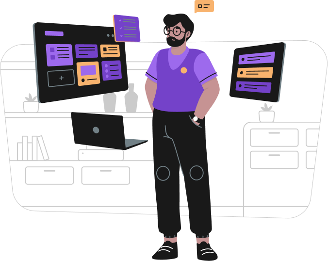

<h2>Love to connect with people and opportunities!</h2>

- Currently specializing myself in JavaScript  
Interested in: React and Node  

- My Skills: 
  HTML, CSS, C, JavaScript, Java and Python

 

<!--
**neoguiz/neoguiz** is a ✨ _special_ ✨ repository because its `README.md` (this file) appears on your GitHub profile.

Here are some ideas to get you started:

- 🔭 I’m currently working on ...
- 🌱 I’m currently learning ...
- 👯 I’m looking to collaborate on ...
- 🤔 I’m looking for help with ...
- 💬 Ask me about ...
- 📫 How to reach me: ...
- 😄 Pronouns: ...
- ⚡ Fun fact: ...
-->
